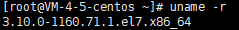
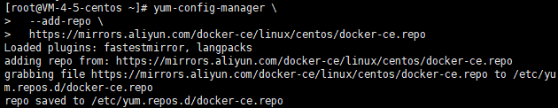
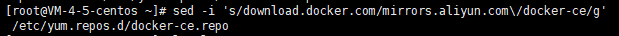
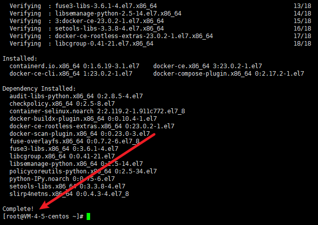
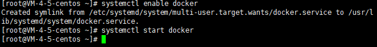
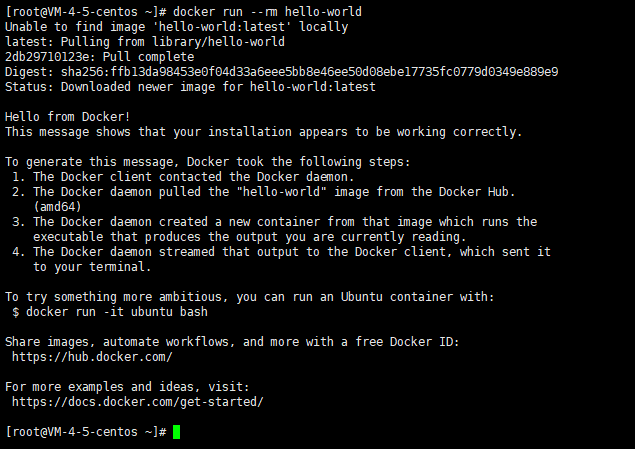

# CentOS安装Docker

# 准备工作

## 系统要求

这里使用CentOS7安装Docker，官方建议内核版本不低于3.10

可以使用 `uname -r` 查看内核版本。我下面的一切操作都是使用 `root`用户，若是普通用户则需要加上 `sudo`。



## 卸载旧版本

旧版本的 `Docker`被称为 `docker`或者 `docker-engine`，使用以下命令卸载：

```shell
yum remove docker \
                  docker-client \
                  docker-client-latest \
                  docker-common \
                  docker-latest \
                  docker-latest-logrotate \
                  docker-logrotate \
                  docker-selinux \
                  docker-engine-selinux \
                  docker-engine
```

# 使用 yum 安装

执行以下命令安装依赖包：

```shell
yum install -y yum-utils
```

这里由于国内网络问题，强烈建议使用国内源，执行以下命令添加 `yum`软件源：

```shell
yum-config-manager \
  --add-repo \
  https://mirrors.aliyun.com/docker-ce/linux/centos/docker-ce.repo
  
sed -i 's/download.docker.com/mirrors.aliyun.com\/docker-ce/g'    /etc/yum.repos.d/docker-ce.repo
```





## 安装Docker

更新 `yum` 软件源缓存，并安装 `docker-ce`

```shell
yum install docker-ce docker-ce-cli containerd.io docker-compose-plugin
```

最后看到 `complete`即可



# CentOS8额外配置

由于CentOS8防火墙使用了 `nftables`，但是Docker尚未支持，我们可以通过如下设置使用 `iptables`更改 `/etc/fireward/firewalld.conf`：

```shell
# FirewallBackend=nftables
FirewallBackend=iptables
```

或者是：

```shell
firewall-cmd --permanent --zone=trusted --add-interface=docker0

firewall-cmd --reload
```

# 使用脚本自动安装

在测试或开发环境中Docker官方为了简化安装流程，提供了一套便捷的安装脚本，CentOS系统上可以使用这套脚本安装，另外可以通过 `--mirror` 选项使用国内源进行安装：

```shell
curl -fsSL get.docker.com -o get-docker.sh

sudo sh get-docker.sh --mirror Aliyun
```

执行这个命令后，脚本就会自动的将一切准备工作做好，并且把Docker的稳定版安装在系统中。

# 启动Docker

```shell
systemctl enable docker
systemctl start docker
```



# 建立docker用户组

默认情况下，`docker`命令会使用 `Unix socket`与Docker引擎通讯。而只有 `root`组和 `docker`组的用户才可以访问Docker引擎的 `Unix socket`。出于安全考虑，Linux系统一般不会使用 `root`用户，因此最好的方法就是使用 `docker`的用户加入到 `docker`用户组。

我这里先添加用户：

```shell
useradd docker
```

建立 `docker`组：

```shell
groupadd docker
```

将用户加入到 `docker`组：

```shell
usermod -aG docker docker

# 将当前用户加入到docker组
# usermod -aG docker $USER
```

# 测试Docker是否安装正确

退出当前终端并重新登录，并输入：

```shell
docker run --rm hello-world
```

能输出下面信息就代表成功！



# 配置镜像加速器

首先查看是否配置过：

```shell
systemctl cat docker | grep '\-\-registry\-mirror'
```

若有输出，那么请执行 `$ systemctl cat docker` 查看 `ExecStart=` 出现的位置，修改对应的文件内容去掉 `--registry-mirror` 参数及其值，并按接下来的步骤进行配置。

如果没有输出，那么就在 `/etc/docker/daemon.json`中写入下面内容：

```json
{
  "registry-mirrors": [
    "https://hub-mirror.c.163.com",
    "https://mirror.baidubce.com"
  ]
}
```

之后重新启动服务

```sh
systemctl daemon-reload
systemctl restart docker
```

# 添加内核参数

如果在 CentOS使用Docker看到下面的这些警告信息：

```sh
WARNING: bridge-nf-call-iptables is disabled
WARNING: bridge-nf-call-ip6tables is disabled
```

请添加内核配置参数以弃用这些功能

```sh
tree -a /etc/systl.conf <<-EOF
net.bridge.bridge-nf-call-ip6tables = 1
net.bridge.bridge-nf-call-iptables = 1
EOF
```

然后重新加载 `systl.conf`即可

```sh
systl -p
```

# 参考文档

- https://vuepress.mirror.docker-practice.com/install/centos/
- https://docs.docker.com/install/linux/docker-ce/centos/
